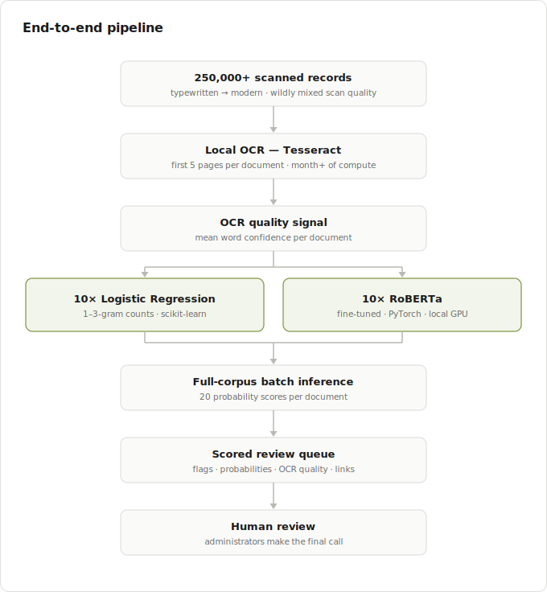
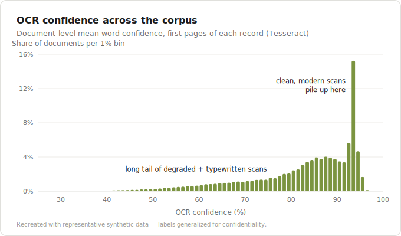
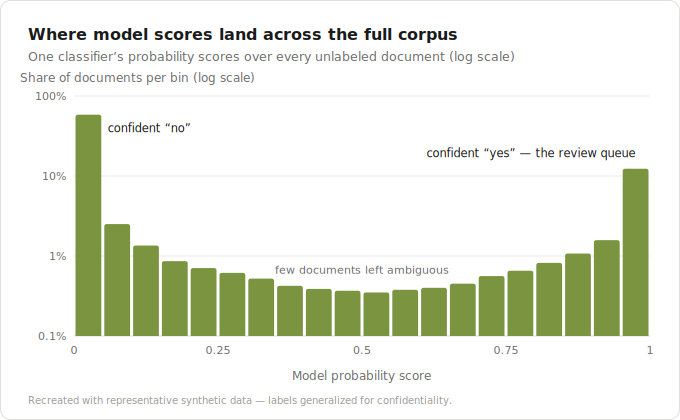
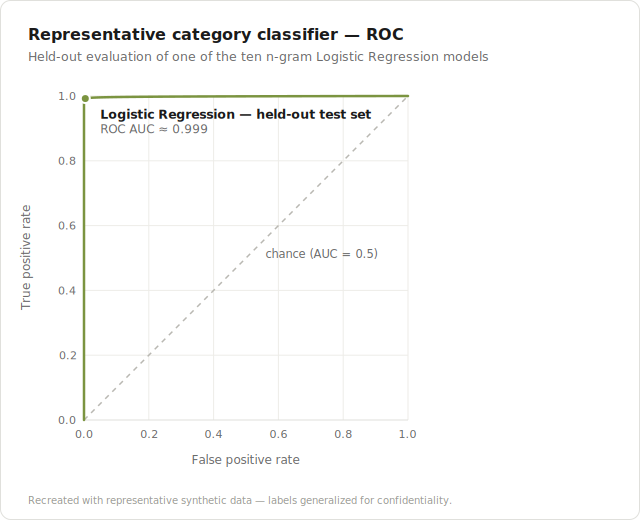

# Large-Scale Document Intelligence Pipeline

End-to-end **local** OCR, NLP, and machine learning system for classifying **250,000+ scanned unclassified records** into 10 business-defined categories — built in a previous federal data science role, and released here as sanitized working notebooks.

Full case study: **[cbroker1.github.io/projects/document-intelligence-pipeline](https://cbroker1.github.io/projects/document-intelligence-pipeline)**

> **What "sanitized" means here.** These are the real project notebooks, edited for public sharing: all cell outputs stripped; category names replaced with `CAT-A` … `CAT-J`; systems, file paths, database names, and metadata fields generalized; per-category duplicate cells collapsed with notes; and two pieces that weren't recovered (the corpus OCR "part 1" notebook and the monthly snapshot-diff script) described or reconstructed and clearly marked as such. Figures are recreations built from synthetic, shape-representative data. The structure, methods, hyperparameters, and quoted metrics are from the original work.

---

## The problem

A repository of 250,000+ scanned records accumulated over decades — typewritten pages digitized long ago through modern computer-generated PDFs — needed each record classified into one of 10 business categories. A fully manual pass would have consumed an enormous amount of administrator time. The system reframed the job from *automate the decision* to **rank the review**: score every document with every category model, and let humans work a confidence-sorted queue instead of an alphabetized pile.

Everything ran locally on workstation hardware. The records were sensitive but unclassified; no cloud OCR, hosted models, or external APIs were an option.

## Architecture

Every document was scored by **20 classifiers** — 10 scikit-learn n-gram Logistic Regression models and 10 fine-tuned RoBERTa models, one of each per category — with the document's OCR confidence carried alongside every score as a data-quality signal.

## How it worked

**1. Local OCR + quality measurement** — Tesseract over the first pages of every document; over a month of local batch compute, with DPI settings chosen by benchmarking recognition quality against processing time and output size. Word-level confidences were aggregated into a document-level OCR quality score, because a model prediction on clean text and the same prediction on garbled text do not deserve equal trust.

**2. Weak labels from filename conventions** — no labeled training set existed. Decades of type codes (and their misspellings) embedded in filenames were mined into labels, cross-referenced against a small metadata database for one category; documents with opaque record-number filenames became the unlabeled deployment set. Each category got a *general* and a *specific* labeling variant to gauge sensitivity to label noise.

**3. Classical models** — per-category binary Logistic Regression over 1–3-gram counts (English stop words removed), minority-class oversampling, L1 regularization with per-category `C` found by randomized search, feature sizes tuned against available RAM.

**4. Transformer models** — RoBERTa-large fine-tuned per category (dropout + linear head) with AdamW, warmup, and gradient clipping. GPU memory (GTX 1080 Ti, 8 GB) capped sequences at 250 of RoBERTa's 512 tokens and batch size at 12; configs that didn't fit fell back to CPU at ~35 hours per epoch.

**5. Full-corpus batch inference** — all 20 models over every document (~200 docs/sec per Logistic Regression model), producing per-category flags and probabilities plus the OCR quality score. Documents already labeled by filename metadata were marked `KNOWN` instead of scored; documents where no model fired were ranked by their maximum cross-model probability so even the "no prediction" pile arrived ordered.

**6. Human-in-the-loop delivery** — a sortable spreadsheet review queue (with formula-built click-to-open links), because the reviewers already lived in spreadsheets. Administrators made every final determination; the models only decided what they looked at first.

**7. Monthly operations** — a recurring intake pass indexed the repository, diffed it against the prior month, OCR'd or re-OCR'd new arrivals (regenerating searchable PDFs at ~42 s/document), scored them through all 20 models, and appended them to the review pool.

## Results

Representative category classifier, held-out test set (values from the original evaluation output; category withheld):

| Metric | Value |
|---|---|
| Accuracy | 99.2% |
| Precision / Recall / F1 | 0.99 / 0.99 / 0.99 |
| ROC AUC | 0.999 |
| Test documents | 10,871 |

Held-out accuracy across the ten-model Logistic Regression family ranged roughly 98–100% (per-category tuning log preserved in notebook 02). The representative RoBERTa classifier reached ~96% validation accuracy after one epoch. Measured conservatively, ranked triage over this corpus likely saved **tens of thousands of administrator hours** versus a fully manual pass — the honest version being that the manual pass would simply never have finished.

## Repository contents

| Path | Contents |
|---|---|
| [`notebooks/01-ocr-quality-analysis.ipynb`](notebooks/01-ocr-quality-analysis.ipynb) | Document-level OCR confidence aggregation and corpus quality analysis |
| [`notebooks/02-logistic-regression-pipeline.ipynb`](notebooks/02-logistic-regression-pipeline.ipynb) | Weak labeling, n-gram Logistic Regression training, evaluation, and full-corpus scoring |
| [`notebooks/03-roberta-transfer-learning.ipynb`](notebooks/03-roberta-transfer-learning.ipynb) | RoBERTa fine-tuning under GPU constraints and corpus scoring (representative category) |
| [`notebooks/04-re-ocr-and-monthly-intake.ipynb`](notebooks/04-re-ocr-and-monthly-intake.ipynb) | Searchable-PDF re-OCR (faithful) and monthly intake detection (reconstructed) |
| [`figures/`](figures/) | Sanitized figure recreations used here and in the case study |

The notebooks are published as a **read-only record of the work** — the data, models, and file layout they reference stayed behind, so they are not runnable as-is.

## Confidentiality note

This release is intentionally generalized to avoid disclosing sensitive operational details, document contents, category names, internal workflows, or agency-specific systems. The focus is the architecture, methods, constraints, and applied machine learning lessons — not the underlying records.
